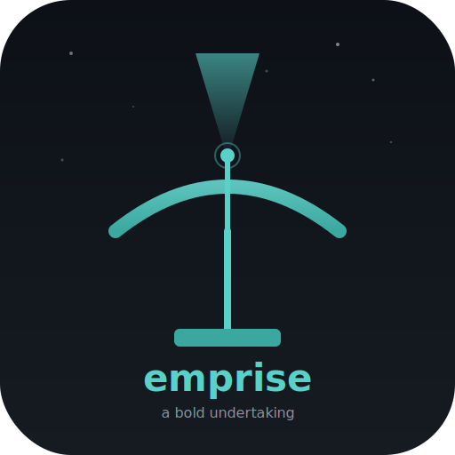

<p align="center">
  
</p>

<h1 align="center">emprise</h1>
<p align="center"><strong>A Bold Undertaking</strong></p>
<p align="center">Cross-platform AI command-line assistant. Like Claude Code, but connecting to your own LLMs.<br>Single binary. Mac, Windows, Linux. Ollama, GitHub Models, OpenAI, Anthropic.</p>

---

## Download

| Platform | Download | Notes |
|----------|----------|-------|
| **macOS (Apple Silicon)** | [emprise-darwin-arm64](https://github.com/senzalldev/emprise-app/releases/latest/download/emprise-darwin-arm64) | Signed & notarized |
| **macOS (Intel)** | [emprise-darwin-amd64](https://github.com/senzalldev/emprise-app/releases/latest/download/emprise-darwin-amd64) | Signed & notarized |
| **Linux (x86_64)** | [emprise-linux-amd64](https://github.com/senzalldev/emprise-app/releases/latest/download/emprise-linux-amd64) | |
| **Windows (x86_64)** | [emprise-windows-amd64.exe](https://github.com/senzalldev/emprise-app/releases/latest/download/emprise-windows-amd64.exe) | |

[All releases](https://github.com/senzalldev/emprise-app/releases)

### Quick Install (Mac/Linux)

```bash
curl -fsSL https://raw.githubusercontent.com/senzalldev/emprise-app/main/install.sh | sh
```

### Update

```bash
emprise update
```

---

## What is emprise?

A single-binary AI assistant that runs in your terminal. Ask it questions, and it can inspect your system, read and edit files, search the web, run commands, and connect to remote servers — all through natural language.

```
$ emprise "what's using all my CPU?"

[tool: get_processes]

Chrome is consuming 82% of your CPU across 8 renderer processes.
The heaviest tab is a Google Sheets document. Close unused tabs
or restart Chrome to free up resources.

  245 in / 89 out / 1204ms
```

## Features

- **Full terminal UI** — scrollable viewport, markdown rendering, syntax highlighting
- **27 built-in tools** — system info, file ops, git, shell, web search, Docker, SSH
- **4 LLM backends** — Ollama (local), GitHub Models (free), OpenAI, Anthropic Claude
- **Named conversations** — `emprise --id "my project" do this thing`
- **Resume** — `emprise --resume "my project"` picks up where you left off
- **Platform-aware** — detects your OS, shell, package manager, available tools
- **Adaptive prompting** — adjusts instructions based on model capability
- **Safety system** — 10 layers of protection against destructive commands
- **Self-update** — `emprise update` downloads the latest version

## Supported LLM Backends

| Backend | Setup | Cost |
|---------|-------|------|
| **Ollama** | Local or remote server | Free |
| **GitHub Models** | GitHub token (no scopes needed) | Free with Copilot |
| **OpenAI** | API key | Pay per token |
| **Anthropic Claude** | API key | Pay per token |
| **Any OpenAI-compatible** | Custom base URL | Varies |

## Built-in Tools

| Category | Tools |
|----------|-------|
| **System** | CPU, memory, disk, processes, network, OS info, environment |
| **Files** | Read, write, edit, create, append, search, grep, list |
| **Git** | Status, log, diff, branch |
| **Shell** | Run any command (with confirmation) |
| **Web** | DuckDuckGo search, fetch URLs |
| **Docker** | Container list, logs, images, compose status |
| **SSH** | Run commands on configured remote hosts |

## Interactive Commands

| Command | Action |
|---------|--------|
| `/clear` | Clear conversation |
| `/name` | Name this conversation |
| `/save` | Save conversation |
| `/resume` | Resume a saved conversation |
| `/history` | List saved conversations |
| `/stats` | Show session metrics |
| `/safety` | Show safety protections |
| `/model` | Show current model |
| `/tools` | List available tools |
| `/ask` | Quick one-off question |
| `/run` | Run shell command directly |
| `/exit` | Quit |

## Safety

emprise has 10 layers of protection:

1. **Hard blocked commands** — `rm -rf /`, disk formatting, fork bombs can never execute
2. **Protected paths** — Cannot write to `/etc`, `/usr`, `C:\Windows`, `/System`
3. **Danger warnings** — `sudo`, `rm -rf`, `git push --force` show prominent warnings
4. **Confirmation required** — All writes, deletes, and commands require Y/n
5. **Command timeout** — Shell commands killed after 30 seconds
6. **Read limits** — File reads capped at 200 lines
7. **Output truncation** — Tool output capped to prevent context flooding
8. **Env filtering** — Hides TOKEN, KEY, SECRET, PASSWORD variables
9. **Platform-aware** — OS-specific blocked commands
10. **LLM prompt** — AI instructed to be careful and ask before acting

## Configuration

First run launches an interactive setup wizard. Config lives at `~/.emprise/config.yaml`:

```yaml
default_profile: local
profiles:
  local:
    provider: ollama
    base_url: http://localhost:11434
    model: llama3.2:3b
  github:
    provider: openai
    base_url: https://models.inference.ai.azure.com
    token: ${GITHUB_TOKEN}
    model: gpt-4o
```

Re-run setup anytime: `emprise --setup`

## Usage Examples

```bash
# Interactive chat
emprise

# Single question
emprise "what's my disk usage?"

# Use a specific LLM
emprise -p github "explain this error"

# Pipe mode
cat error.log | emprise "what went wrong?"

# Named conversation
emprise --id "server ops" check the disk space
emprise --resume "server ops"

# Continue most recent conversation
emprise -c

# List saved conversations
emprise --list
```

---

## The Name

*emprise* — "a bold or adventurous undertaking"

From Michael P. Kube-McDowell's **Trigon Unity** trilogy:
- **Emprise** (1985) — humanity's bold reach to the stars
- **Enigma** (1986) — mysteries of alien origin
- **Empery** (1987) — galactic conflict

The radio dish logo represents the decommissioned telescope rebuilt in *Emprise* to send humanity's first message to the stars — the original bold undertaking.

---

<p align="center">
<sub>Built by <a href="https://github.com/senzalldev">Senzall</a> · Powered by Go · macOS binaries signed & notarized</sub>
</p>
